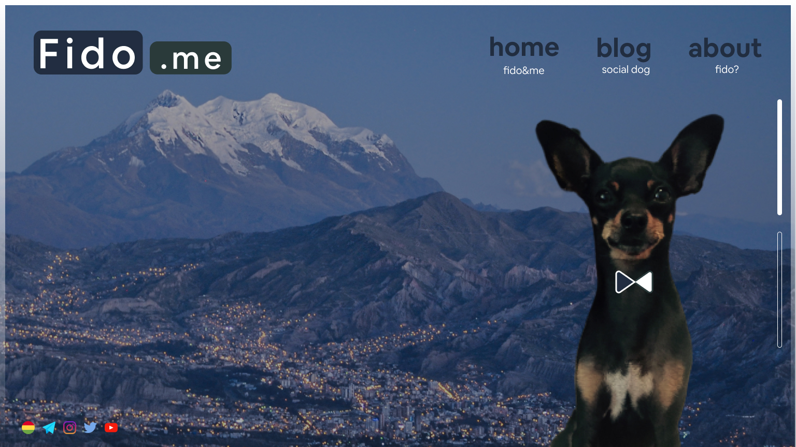
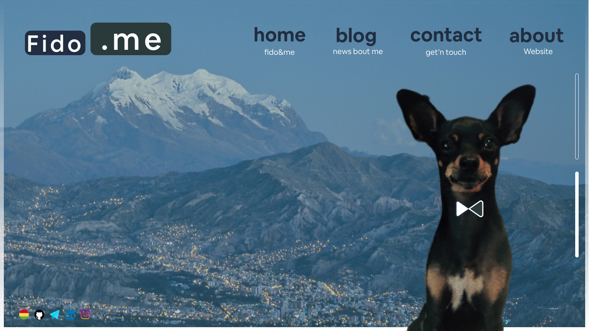

# Fido & Me. Web.
Personal webblog. You are free to clone it.
Hopem you like it!

## Landing page.
UI - FIDO

UI - ME

I have used FIGMA for the prototype.
website: https://www.figma.com

## FrontEnd
EJS template engine is being used in client side.
website: https://ejs.co/

## BackEnd
Express JS is being used as Node Js framework in server side.
website: https://expressjs.com/

<footer>

RV 2020. UCB - Bolivia.

</footer>